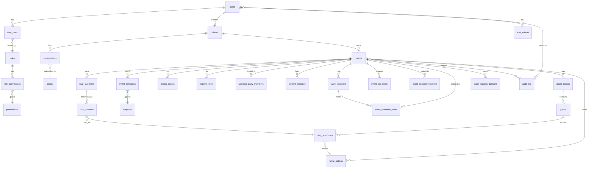

# CONTEXTO BASE DE DATOS - invitaciones_ci4

> **Nota**: Este proyecto NO usa migraciones automáticas. La estructura aquí reflejada es la real en producción.

---

## 📋 TABLAS PRINCIPALES

### users
- **PK:** id (UUID)
- **FKs Inferidas:** Ninguna
- **Cols Importantes:**
  - email (varchar, UNIQUE) - Correo electrónico
  - password_hash (varchar) - Hash de contraseña
  - full_name (varchar) - Nombre completo
  - phone (varchar) - Teléfono
  - is_active (tinyint) - Usuario activo/inactivo
  - email_verified_at (datetime) - Verificación email
  - last_login_at (datetime) - Último acceso
- **Propósito:** Usuarios del sistema (administradores y clientes). Base para autenticación.

---

### clients
- **PK:** id (UUID)
- **FKs Inferidas:** user_id -> users
- **Cols Importantes:**
  - user_id (UUID, UNIQUE) - Relación 1:1 con usuario
  - company_name (varchar) - Nombre empresa/negocio
  - notes (text) - Notas internas
- **Propósito:** Extensión de usuarios para clientes que contratan servicios de invitaciones.

---

### events
- **PK:** id (UUID)
- **FKs Inferidas:** client_id -> clients
- **Cols Importantes:**
  - client_id (UUID) - Propietario del evento
  - slug (varchar, UNIQUE) - URL amigable (ej: ana-y-juan)
  - couple_title (varchar) - Título de la pareja (ej: "Ana & Juan")
  - bride_name (varchar) - Nombre de la novia
  - groom_name (varchar) - Nombre del novio
  - primary_contact_email (varchar) - Email de contacto
  - time_zone (varchar) - Zona horaria (default: America/Mexico_City)
  - event_date_start (datetime) - Fecha/hora inicio evento
  - event_date_end (datetime) - Fecha/hora fin evento
  - rsvp_deadline (datetime) - Fecha límite confirmaciones
  - site_mode (enum: auto/pre/live/post) - Modo visualización sitio
  - visibility (enum: public/private) - Visibilidad del evento
  - access_mode (enum: open/invite_code) - Modo de acceso
  - venue_name (varchar) - Nombre del lugar
  - venue_address (text) - Dirección completa
  - venue_geo_lat/venue_geo_lng (decimal) - Coordenadas GPS
  - venue_config (json) - Configuración adicional lugar
  - theme_config (json) - Configuración visual/tema
  - is_demo (tinyint) - Evento de demostración
  - service_status (enum: draft/active/suspended/archived) - Estado del servicio
  - is_paid (tinyint) - Evento pagado
  - paid_until (datetime) - Fecha límite de pago
- **Propósito:** Eventos/bodas. Core del negocio. Cada evento tiene invitación digital personalizada.

---

### guest_groups
- **PK:** id (UUID)
- **FKs Inferidas:** event_id -> events
- **Cols Importantes:**
  - event_id (UUID) - Evento al que pertenece
  - group_name (varchar) - Nombre del grupo (ej: "Familia López")
  - access_code (varchar) - Código para acceso RSVP
  - max_additional_guests (int) - Invitados adicionales permitidos
  - is_vip (tinyint) - Grupo VIP
  - current_status (enum: invited/viewed/partial/responded) - Estado del grupo
  - invited_at (datetime) - Fecha invitación enviada
  - first_viewed_at (datetime) - Primera visualización
  - last_viewed_at (datetime) - Última visualización
  - responded_at (datetime) - Fecha respuesta RSVP
- **Propósito:** Agrupa invitados (familias/grupos). Cada grupo tiene código único para RSVP.

---

### guests
- **PK:** id (UUID)
- **FKs Inferidas:** group_id -> guest_groups
- **Cols Importantes:**
  - group_id (UUID) - Grupo al que pertenece
  - first_name (varchar) - Nombre
  - last_name (varchar) - Apellido
  - email (varchar) - Email del invitado
  - phone_number (varchar) - Teléfono
  - is_child (tinyint) - Es menor de edad
  - is_primary_contact (tinyint) - Contacto principal del grupo
  - rsvp_status (enum: pending/accepted/declined) - Estado confirmación
- **Propósito:** Invitados individuales dentro de grupos. Cada invitado puede confirmar asistencia.

---

### rsvp_responses
- **PK:** id (UUID)
- **FKs Inferidas:** 
  - guest_id -> guests
  - meal_option_id -> menu_options
- **Cols Importantes:**
  - event_id (UUID) - Evento asociado
  - guest_id (UUID) - Invitado que responde
  - attending / attending_status (enum: pending/accepted/declined) - ¿Asistirá?
  - meal_option_id (UUID) - Opción de menú seleccionada
  - dietary_restrictions (text) - Restricciones alimentarias
  - transportation_requested (tinyint) - Solicita transporte
  - song_request (varchar) - Canción solicitada
  - message / message_to_couple (text) - Mensaje para los novios
  - responded_at (datetime) - Fecha de respuesta
  - response_method (varchar) - Método de respuesta (web/email/etc)
- **Propósito:** Respuestas RSVP de invitados. Captura preferencias y confirmaciones.

---

### event_templates
- **PK:** Compuesta (event_id, template_id)
- **FKs Inferidas:** 
  - event_id -> events
  - template_id -> templates
- **Cols Importantes:**
  - event_id (UUID) - Evento
  - template_id (int) - Template aplicado
  - is_active (tinyint) - Template activo
  - applied_at (datetime) - Fecha de aplicación
- **Propósito:** Relación evento-template. Un evento puede tener múltiples templates históricos.

---

### templates
- **PK:** id (auto_increment)
- **FKs Inferidas:** Ninguna
- **Cols Importantes:**
  - code (varchar, UNIQUE) - Código interno (lovelove, solene, sukun, weddingo)
  - name (varchar) - Nombre público
  - description (text) - Descripción del template
  - preview_url (varchar) - URL de vista previa
  - thumbnail_url (varchar) - Miniatura
  - is_public (tinyint) - Visible para todos
  - is_active (tinyint) - Activo/disponible
  - sort_order (int) - Orden de visualización
  - schema_json (json) - Schema de configuración
  - meta_json (json) - Metadatos adicionales
- **Propósito:** Catálogo de templates/temas visuales para invitaciones.

---

### media_assets
- **PK:** id (UUID)
- **FKs Inferidas:** event_id -> events
- **Cols Importantes:**
  - event_id (UUID) - Evento propietario
  - file_url_original (varchar) - URL archivo original
  - file_url_thumbnail (varchar) - URL miniatura
  - file_url_large (varchar) - URL versión grande
  - mime_type (varchar) - Tipo de archivo
  - alt_text (varchar) - Texto alternativo
  - caption (text) - Descripción/caption
  - aspect_ratio (decimal) - Ratio de aspecto
  - category_tag (varchar) - Etiqueta de categoría (deprecated)
  - category (varchar) - Categoría (gallery, hero, etc)
  - sort_order (int) - Orden de visualización
  - is_private (tinyint) - Archivo privado
- **Propósito:** Galería multimedia de eventos (fotos, videos). Versionado automático de imágenes.

---

### menu_options
- **PK:** id (UUID)
- **FKs Inferidas:** event_id -> events
- **Cols Importantes:**
  - event_id (UUID) - Evento
  - name (varchar) - Nombre del platillo
  - description (varchar) - Descripción
  - is_vegan (tinyint) - Opción vegana
  - is_gluten_free (tinyint) - Sin gluten
  - is_kid_friendly (tinyint) - Para niños
  - sort_order (int) - Orden
- **Propósito:** Opciones de menú para selección en RSVP.

---

### registry_items
- **PK:** id (UUID)
- **FKs Inferidas:** event_id -> events
- **Cols Importantes:**
  - event_id (UUID) - Evento
  - title (varchar) - Título del regalo
  - name (varchar) - Nombre (duplicado, legacy)
  - description (text) - Descripción
  - category (varchar) - Categoría
  - image_url (varchar) - Imagen del producto
  - product_url (varchar) - URL producto (legacy)
  - external_url (varchar) - URL externa
  - price (decimal) - Precio unitario
  - currency_code (char) - Moneda (default: MXN)
  - is_fund (tinyint) - Es fondo monetario
  - fund_goal (decimal) - Meta de fondo (legacy)
  - quantity_requested (int) - Cantidad solicitada
  - quantity_fulfilled (int) - Cantidad cumplida
  - goal_amount (decimal) - Meta monetaria
  - current_amount (decimal) - Monto actual (legacy)
  - amount_collected (decimal) - Monto recaudado
  - is_claimed (tinyint) - Ya fue apartado/comprado
  - is_priority (tinyint) - Regalo prioritario
  - is_visible (tinyint) - Visible en lista
  - sort_order (int) - Orden
  - claimed_by (varchar) - Apartado por
  - claimed_at (datetime) - Fecha de apartado
- **Propósito:** Mesa de regalos del evento. Soporta productos físicos y fondos monetarios.

---

### wedding_party_members
- **PK:** id (UUID)
- **FKs Inferidas:** event_id -> events
- **Cols Importantes:**
  - event_id (UUID) - Evento
  - full_name (varchar) - Nombre completo
  - role (varchar) - Rol (padrino, dama, etc)
  - category (enum: bride_side/groom_side/officiant/other) - Bando
  - bio (text) - Biografía
  - image_url (varchar) - Foto del miembro
  - social_links (json) - Redes sociales
  - display_order (int) - Orden de visualización
- **Propósito:** Cortejo nupcial (padrinos, damas, oficiante).

---

### leads
- **PK:** id (UUID)
- **FKs Inferidas:** Ninguna
- **Cols Importantes:**
  - full_name (varchar) - Nombre completo
  - email (varchar) - Email
  - phone (varchar) - Teléfono
  - event_date (date) - Fecha evento estimada
  - message (text) - Mensaje del prospecto
  - source (varchar) - Fuente de captura
  - status (enum: new/contacted/qualified/won/lost) - Estado del lead
  - utm_payload (json) - Parámetros UTM de marketing
- **Propósito:** Prospectos capturados desde landing page. CRM básico.

---

### content_modules
- **PK:** id (UUID)
- **FKs Inferidas:** event_id -> events
- **Cols Importantes:**
  - event_id (UUID) - Evento
  - module_type (varchar) - Tipo de módulo (hero, story, timeline, etc)
  - css_id (varchar) - ID CSS para anclas
  - sort_order (int) - Orden de visualización
  - is_enabled (tinyint) - Módulo activo
  - content_payload (json) - Contenido del módulo
- **Propósito:** Módulos dinámicos de contenido para templates. Sistema de bloques.

---

## 📊 TABLAS DE AUTORIZACIÓN

### roles
- **PK:** id (auto_increment)
- **Cols Importantes:**
  - name (varchar, UNIQUE) - Nombre del rol (admin, client, superadmin)
  - description (varchar) - Descripción
- **Propósito:** Roles del sistema RBAC.

---

### user_roles
- **PK:** Compuesta (user_id, role_id)
- **FKs Inferidas:**
  - user_id -> users
  - role_id -> roles
- **Propósito:** Relación usuarios-roles (muchos a muchos).

---

### permissions
- **PK:** id (auto_increment)
- **Cols Importantes:**
  - name (varchar, UNIQUE) - Nombre del permiso
  - description (varchar) - Descripción
- **Propósito:** Permisos granulares del sistema.

---

### role_permissions
- **PK:** Compuesta (role_id, permission_id)
- **FKs Inferidas:**
  - role_id -> roles
  - permission_id -> permissions
- **Propósito:** Relación roles-permisos (muchos a muchos).

---

## 🗺️ TABLAS DE UBICACIÓN Y PROGRAMACIÓN

### event_locations
- **PK:** id (UUID)
- **FKs Inferidas:** event_id -> events
- **Cols Importantes:**
  - event_id (UUID) - Evento
  - code (varchar) - Código interno (ceremony, reception, etc)
  - name (varchar) - Nombre del lugar
  - address (text) - Dirección
  - geo_lat/geo_lng (decimal) - Coordenadas GPS
  - maps_url (varchar) - URL Google Maps
  - waze_url (varchar) - URL Waze
  - notes (text) - Notas adicionales
  - sort_order (int) - Orden
- **Propósito:** Múltiples ubicaciones por evento (ceremonia, recepción, hotel, etc).

---

### event_schedule_items
- **PK:** id (UUID)
- **FKs Inferidas:** 
  - event_id -> events
  - location_id -> event_locations
- **Cols Importantes:**
  - event_id (UUID) - Evento
  - location_id (UUID) - Ubicación del item
  - title (varchar) - Título del item
  - description (text) - Descripción
  - starts_at (datetime) - Inicio
  - ends_at (datetime) - Fin
  - icon (varchar) - Icono visual
  - sort_order (int) - Orden
  - is_visible (tinyint) - Visible en invitación
- **Propósito:** Cronograma/agenda del evento (ceremonia 5pm, recepción 7pm, etc).

---

### event_faq_items
- **PK:** id (UUID)
- **FKs Inferidas:** event_id -> events
- **Cols Importantes:**
  - event_id (UUID) - Evento
  - question (varchar) - Pregunta
  - answer (text) - Respuesta
  - sort_order (int) - Orden
  - is_visible (tinyint) - Visible
- **Propósito:** Preguntas frecuentes del evento.

---

### event_recommendations
- **PK:** id (UUID)
- **FKs Inferidas:** event_id -> events
- **Cols Importantes:**
  - event_id (UUID) - Evento
  - type (enum: hotel/transport/restaurant/other) - Tipo
  - title (varchar) - Título
  - description (text) - Descripción
  - url (varchar) - URL externa
  - image_url (varchar) - Imagen
  - sort_order (int) - Orden
  - is_visible (tinyint) - Visible
- **Propósito:** Recomendaciones de hoteles, restaurantes, transporte para invitados.

---

## 📝 TABLAS DE FORMULARIOS RSVP

### rsvp_questions
- **PK:** id (UUID)
- **FKs Inferidas:** event_id -> events
- **Cols Importantes:**
  - event_id (UUID) - Evento
  - code (varchar) - Código interno
  - label (varchar) - Etiqueta de la pregunta
  - type (enum: text/textarea/select/checkbox/radio/number) - Tipo de input
  - options_json (json) - Opciones para select/radio/checkbox
  - is_required (tinyint) - Campo obligatorio
  - sort_order (int) - Orden
  - is_active (tinyint) - Pregunta activa
- **Propósito:** Preguntas personalizadas para formulario RSVP (alergias, canciones, etc).

---

### rsvp_answers
- **PK:** id (UUID)
- **FKs Inferidas:**
  - rsvp_response_id -> rsvp_responses
  - question_id -> rsvp_questions
- **Cols Importantes:**
  - rsvp_response_id (UUID) - Respuesta RSVP
  - question_id (UUID) - Pregunta respondida
  - value_text (text) - Valor texto
  - value_json (json) - Valor estructurado
- **Propósito:** Respuestas a preguntas personalizadas de RSVP.

---

### event_form_submissions
- **PK:** event_id
- **FKs Inferidas:** 
  - event_id -> events
  - template_id -> templates
- **Cols Importantes:**
  - event_id (UUID) - Evento
  - template_id (int) - Template usado
  - payload (json) - Datos del formulario
  - last_saved_at (datetime) - Último guardado
- **Propósito:** Guardado de formularios de configuración de eventos (borrador).

---

## 🌐 TABLAS DE DOMINIOS Y SUSCRIPCIONES

### event_custom_domains
- **PK:** id (UUID)
- **FKs Inferidas:** event_id -> events
- **Cols Importantes:**
  - event_id (UUID) - Evento
  - domain (varchar, UNIQUE) - Dominio personalizado
  - status (enum: pending_dns/active/disabled) - Estado DNS
- **Propósito:** Dominios personalizados para eventos (ej: anajuan.com).

---

### plans
- **PK:** id (auto_increment)
- **Cols Importantes:**
  - code (varchar, UNIQUE) - Código del plan (essential, interactive, infinity)
  - name (varchar) - Nombre público
  - description (varchar) - Descripción
  - is_active (tinyint) - Plan activo
- **Propósito:** Planes de servicio/paquetes.

---

### subscriptions
- **PK:** id (UUID)
- **FKs Inferidas:**
  - client_id -> clients
  - plan_id -> plans
- **Cols Importantes:**
  - client_id (UUID) - Cliente suscrito
  - plan_id (int) - Plan contratado
  - status (enum: trial/active/paused/expired/cancelled) - Estado
  - starts_at (datetime) - Inicio suscripción
  - ends_at (datetime) - Fin suscripción
  - paid_through (datetime) - Pagado hasta
  - external_ref (varchar) - Referencia externa (Stripe/PayPal)
  - notes (text) - Notas
- **Propósito:** Gestión de suscripciones de clientes a planes.

---

## 🔐 TABLAS DE AUTENTICACIÓN Y SEGURIDAD

### auth_tokens
- **PK:** id (auto_increment)
- **FKs Inferidas:** user_id -> users
- **Cols Importantes:**
  - user_id (UUID) - Usuario propietario
  - token_hash (char, UNIQUE) - Hash del token
  - token_type (enum: api/remember/reset/verify) - Tipo
  - expires_at (datetime) - Expiración
  - revoked_at (datetime) - Revocación
- **Propósito:** Tokens de autenticación (API, reset password, remember me).

---

### ci_sessions
- **PK:** id (varchar)
- **Cols Importantes:**
  - id (varchar) - Session ID
  - ip_address (varchar) - IP del usuario
  - timestamp (timestamp) - Marca temporal
  - data (blob) - Datos serializados de sesión
- **Propósito:** Almacenamiento de sesiones de CodeIgniter.

---

## 📋 TABLAS DE AUDITORÍA Y LOGS

### audit_log
- **PK:** id (auto_increment)
- **FKs Inferidas:**
  - actor_user_id -> users
  - event_id -> events
- **Cols Importantes:**
  - actor_user_id (UUID) - Usuario que realizó acción
  - event_id (UUID) - Evento afectado (nullable)
  - action (varchar) - Acción realizada
  - entity (varchar) - Entidad afectada
  - entity_id (varchar) - ID de entidad
  - ip_address (varchar) - IP
  - user_agent (varchar) - Navegador
  - metadata (json) - Datos adicionales
- **Propósito:** Log de auditoría de acciones en el sistema.

---

### email_queue
- **PK:** id (auto_increment)
- **FKs Inferidas:** event_id -> events
- **Cols Importantes:**
  - event_id (UUID) - Evento relacionado
  - to_email (varchar) - Destinatario
  - subject (varchar) - Asunto
  - body_html (mediumtext) - Cuerpo HTML
  - body_text (mediumtext) - Cuerpo texto plano
  - payload (json) - Datos adicionales
  - status (enum: queued/sending/sent/failed) - Estado
  - attempts (int) - Intentos de envío
  - scheduled_at (datetime) - Programado para
  - last_error (text) - Último error
- **Propósito:** Cola de emails pendientes de envío.

---

### email_log
- **PK:** id (auto_increment)
- **FKs Inferidas:** event_id -> events
- **Cols Importantes:**
  - event_id (UUID) - Evento relacionado
  - to_email (varchar) - Destinatario
  - subject (varchar) - Asunto
  - provider (varchar) - Proveedor SMTP
  - status (enum: sent/failed) - Estado
  - provider_message_id (varchar) - ID del proveedor
  - error (text) - Error si falló
- **Propósito:** Histórico de emails enviados.

---

## 🔄 RELACIONES PRINCIPALES (INFERIDAS)

```
users (1) ──── (1) clients
   │
   └──(N) user_roles ──── roles ──── (N) role_permissions ──── permissions

clients (1) ──── (N) events
   │
   └──(N) subscriptions ──── plans

events (1) ──── (N) guest_groups (1) ──── (N) guests (1) ──── (N) rsvp_responses
   │                                                                    │
   ├──(N) event_templates ──── templates                               └──(1) menu_options
   ├──(N) media_assets                                                  
   ├──(N) menu_options
   ├──(N) registry_items
   ├──(N) wedding_party_members
   ├──(N) content_modules
   ├──(N) event_locations (1) ──── (N) event_schedule_items
   ├──(N) event_schedule_items
   ├──(N) event_faq_items
   ├──(N) event_recommendations
   ├──(N) rsvp_questions (1) ──── (N) rsvp_answers ──── rsvp_responses
   └──(N) event_custom_domains
```

---

## 📊 DIAGRAMA MERMAID - TABLAS CORE



---

## 📝 NOTAS IMPORTANTES

1. **Sin Foreign Keys Declaradas**: Las relaciones son por convención de nombres. El código de la aplicación las maneja.
2. **UUIDs vs Auto-Increment**: Tablas core usan UUID (char 36), tablas de configuración/catálogo usan auto_increment.
3. **Timestamps Automáticos**: created_at/updated_at en mayoría de tablas con DEFAULT CURRENT_TIMESTAMP.
4. **Soft Deletes**: NO implementado a nivel DB. Se maneja con flags (is_active, is_visible, service_status).
5. **JSON Fields**: Amplio uso de JSON para configuraciones flexibles (theme_config, venue_config, payload, etc).
6. **Enums**: Uso extensivo de ENUM para estados controlados (status, visibility, access_mode, etc).
7. **Indexación**: Índices en FKs inferidas (client_id, event_id, etc) y campos UNIQUE (email, slug).

---

**Generado**: 2025-02-04  
**Versión DB**: Producción actual (sin migraciones)  
**Total Tablas**: 34
